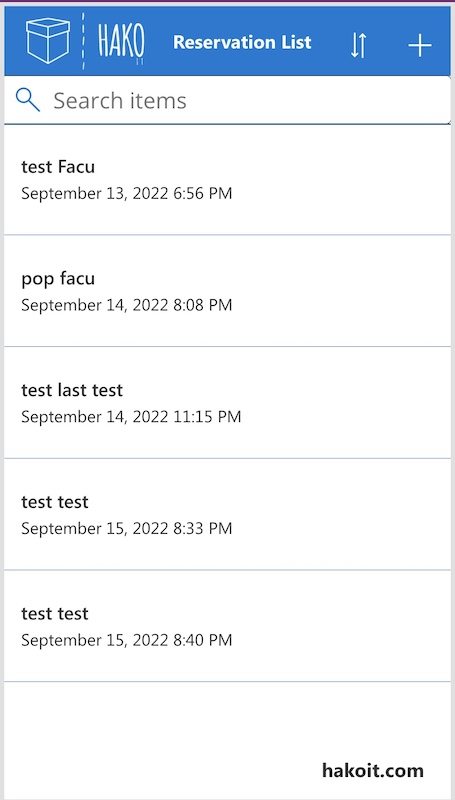
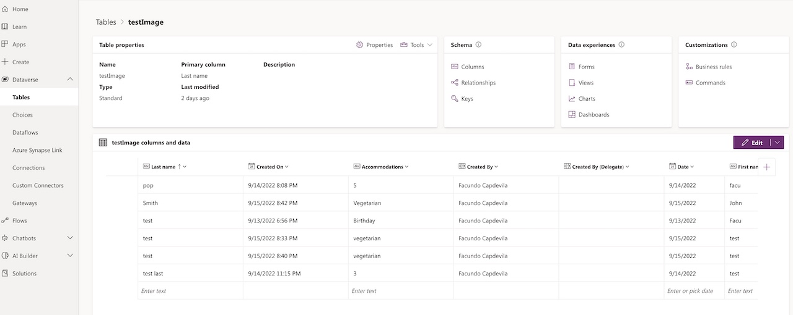

# Reservation Mobile App

Example with Microsoft PowerApps [Power Apps](https://powerapps.microsoft.com/)

Convert an image into an app
-Upload an image of an app or form and we’ll convert it into an app

## Screenshots

## Requirements
You will need to Create a Dataverse Table to work with the app

